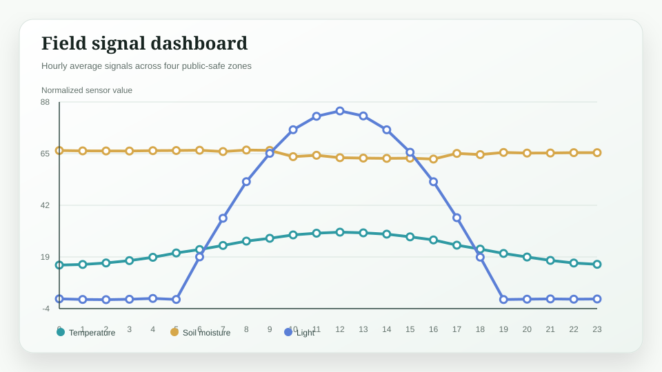
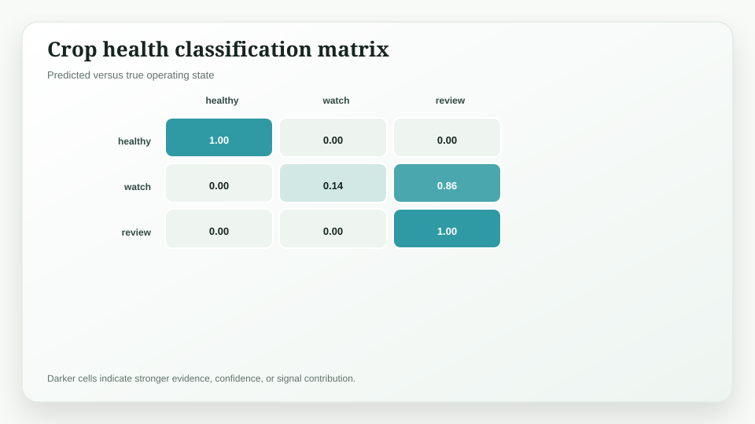
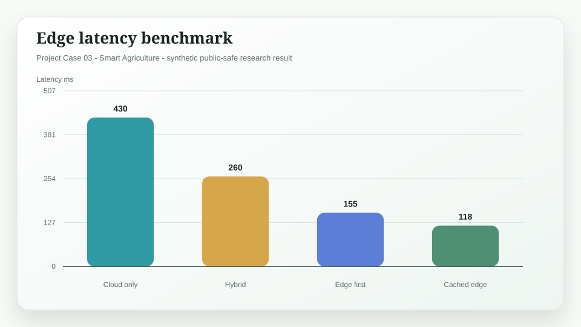

# Xiangxin AIoT Agriculture Platform

> Project Case 03 / Smart Agriculture

A smart agriculture AIoT platform prototype that combines edge sensing, computer vision, and human-reviewable recommendations.

This repository is a standalone public portfolio project. All data and results are synthetic or public-safe demonstration artifacts. It contains no private datasets, credentials, proprietary reports, user records, or sensitive operational information.

## Research Question

How can field observations, crop images, and agricultural knowledge become a practical operating loop for growers?

## Method Stack

Computer Vision · Edge AI · Sensor Fusion · Knowledge Service

## Key Results

| Metric | Result | Interpretation |
| --- | ---: | --- |
| Crop alert precision | 0.89 | Synthetic validation on balanced public-safe condition classes |
| Edge latency reduction | -64% | On-device inference benchmark versus cloud-only path |
| Action trace coverage | 96% | Alerts mapped to recommended review or work-order state |

## Research Figures



**Figure:** Field signal dashboard.


**Figure:** Crop health classification matrix.


**Figure:** Edge latency benchmark.

## Repository Structure

```text
.
├── README.md
├── data/
│   └── public_safe_results.csv
├── docs/
│   ├── index.html
│   └── figures/
├── results/
│   └── key_findings.md
└── scripts/
    └── reproduce_results.py
```

## Reproduce

The reproduction script uses only Python standard library functions and deterministic data bundled in this repository.

```bash
python3 scripts/reproduce_results.py
```

## Research Design Principles

- Evidence first: every conclusion should be connected to an inspectable signal.
- Human review: model outputs support judgement, not blind automation.
- Explicit uncertainty: scenario branches, risk gates, or review flags are visible.
- Public-safe release: results are designed for portfolio demonstration, not disclosure of private material.

## License

Released under the MIT License.
